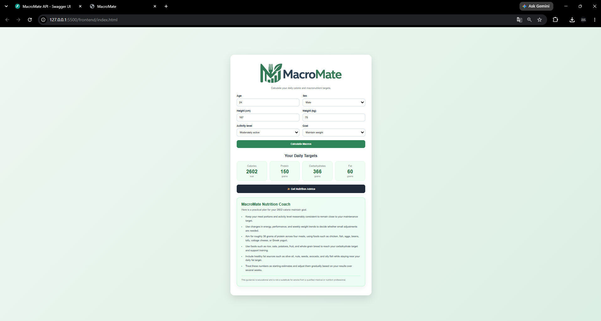
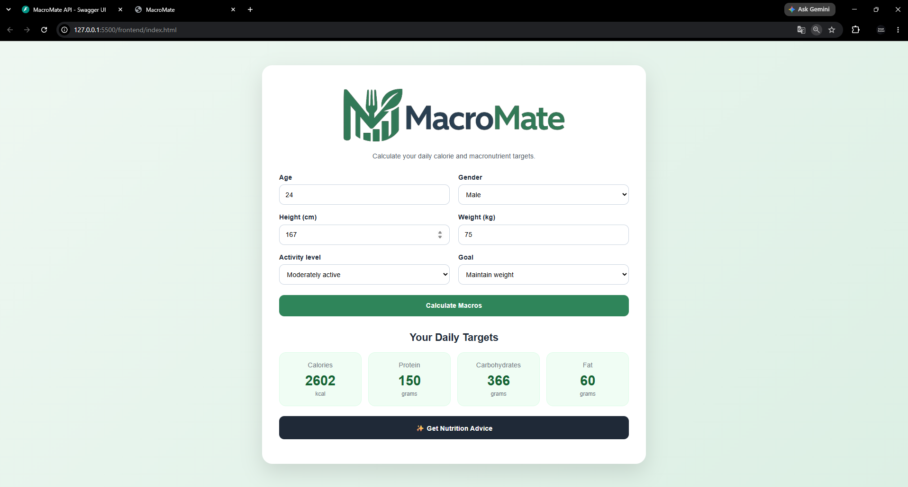
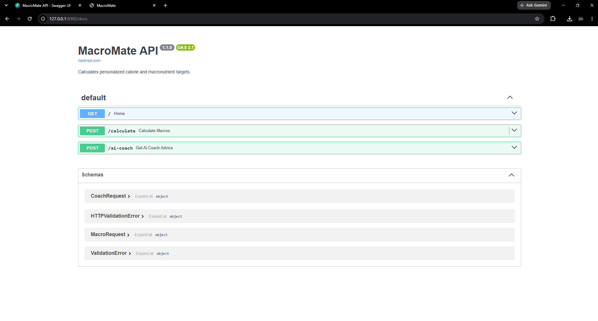
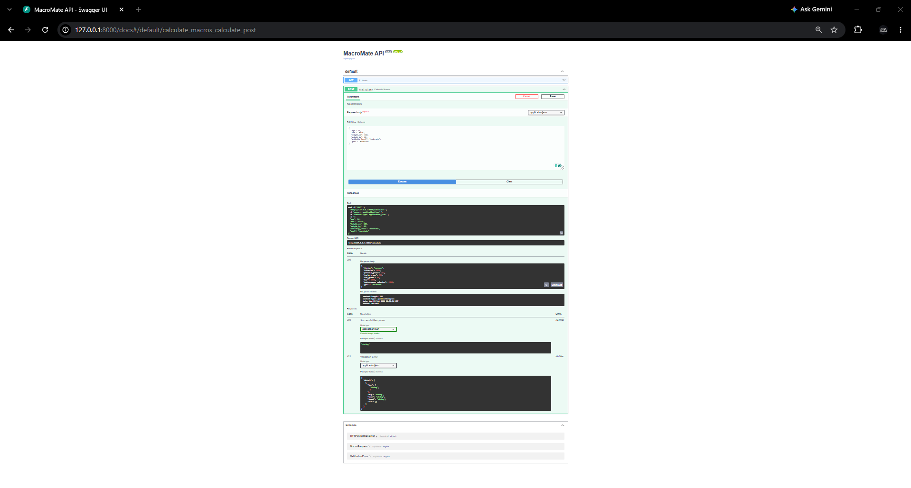
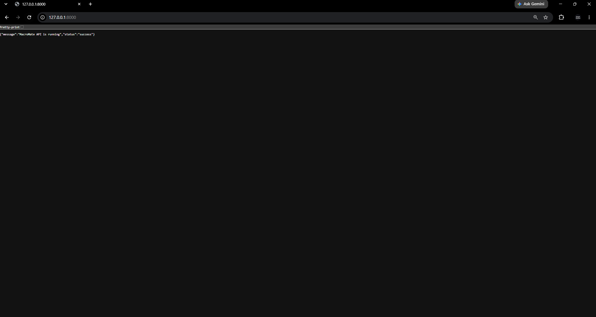

# MacroMate

A full-stack nutrition calculator that generates personalized daily calorie and macronutrient targets based on user information.

MacroMate calculates calories, protein, carbohydrates, and fat requirements using the Mifflin-St Jeor equation and provides personalized nutrition guidance through a built-in nutrition coach.

The project includes a Python FastAPI backend, REST API, and a responsive web dashboard for calculating and displaying nutrition targets.

--------------------------------------------------

## Project Overview

Planning daily nutrition can be difficult without knowing how many calories and macronutrients your body requires.

This project calculates personalized nutrition targets by using:
- Age
- Gender
- Height
- Weight
- Activity Level
- Fitness Goal

The application estimates daily calorie requirements, calculates macronutrient targets, and provides personalized nutrition recommendations based on the user's goals.

--------------------------------------------------

## Features

### Macro Calculator
- Calculates Basal Metabolic Rate (BMR)
- Calculates maintenance calories
- Adjusts calories for weight loss, maintenance, or muscle gain
- Calculates daily protein, carbohydrate, and fat targets

### Nutrition Coach

The nutrition coach provides personalized nutrition guidance using rule-based recommendations generated from the user's calculated calorie and macronutrient targets.

### Personalized Recommendations
- Goal-specific nutrition guidance
- Protein intake recommendations
- Carbohydrate recommendations
- Healthy fat suggestions

### Goal Support
- Weight loss guidance
- Maintenance guidance
- Muscle gain recommendations

### REST API
- Exposes macro calculations through HTTP requests
- Returns results in JSON format
- Provides nutrition coaching through a dedicated API endpoint

### Web Dashboard
- Responsive user interface
- Displays calculated calorie targets
- Displays daily macronutrient goals
- Displays personalized nutrition guidance

--------------------------------------------------

## System Architecture

```
Frontend
(HTML / CSS / JavaScript)
          |
          v
REST API
(FastAPI)
          |
          v
Macro Calculation Engine
          |
          v
Nutrition Coach
```

--------------------------------------------------

## Technologies Used

Backend:
- Python
- FastAPI
- Pydantic
- Uvicorn

Frontend:
- HTML
- CSS
- JavaScript

Tools:
- Visual Studio Code
- Git/GitHub
- Swagger UI (OpenAPI)

--------------------------------------------------

## API Endpoints

The application exposes two REST API endpoints:

| Endpoint | Method | Purpose |
|----------|--------|---------|
| `/calculate` | POST | Calculate calories and macronutrients |
| `/ai-coach` | POST | Generate personalized nutrition guidance |

--------------------------------------------------

## Screenshots

### Dashboard



### Nutrition Coach



### API Documentation



### Macro Calculation API



### Backend API Running


--------------------------------------------------

## How To Run

### Requirements

- Python 3.14+
- FastAPI
- Uvicorn

### Install Dependencies

```
pip install fastapi uvicorn
```

### Start Backend

```
python -m uvicorn backend.main:app --reload
```

The API will run on:

```
http://127.0.0.1:8000
```

Swagger documentation:

```
http://127.0.0.1:8000/docs
```

### Start Frontend

Open:

```
Frontend/index.html
```

using VS Code Live Server.

The frontend communicates with:

```
POST http://127.0.0.1:8000/calculate

POST http://127.0.0.1:8000/ai-coach
```

--------------------------------------------------

## Future Improvements

- User authentication
- Meal planning recommendations
- Nutrition history tracking
- Database integration
- External AI provider support
- Food search and meal logging

--------------------------------------------------

## Project Purpose

This project explores full-stack web development by combining a Python FastAPI backend with a responsive JavaScript frontend to build a practical nutrition application.

The goal was to design a clean REST API, perform personalized nutrition calculations, and present the results through an intuitive user interface while demonstrating backend API development, frontend integration, and modern web application architecture.
